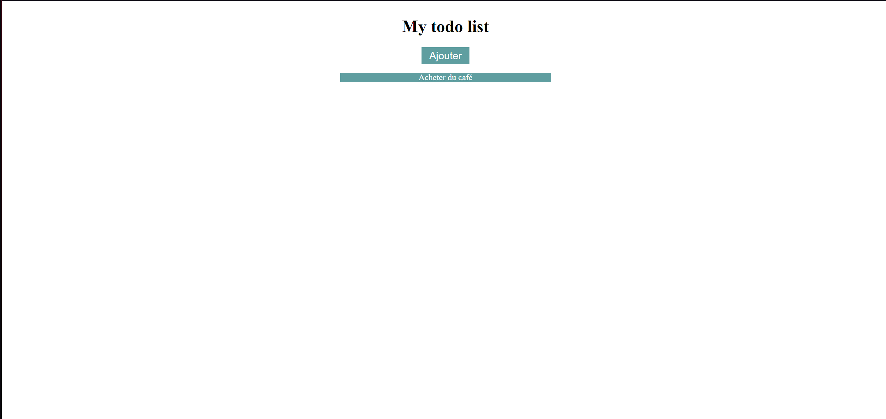

# Ajoutons du style à notre to do list

Pour l'instant ça ne resemble pas à grand chose alors ajoutons un peu de CSS.

### Etapes à suivre


- Créer une feuille CSS "style.css"
- Ajouter la feuille à au document avec une balise de style
```<link rel="stylesheet" href="style.css">```
- Center les éléments
- Changer la couleur et la taille du bouton
- Changer la couleur de fond de la tâche


### Rendu attendu

