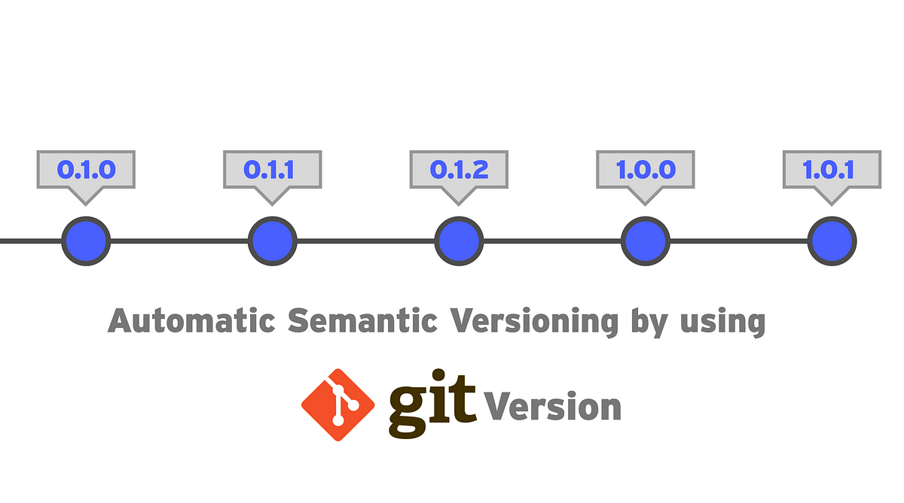
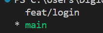

# Versionner son code

Dans cet exercice, nous allons voir comment créer différentes version de son code.

Pour cela nous allons utiliser git.

Dans un un premier temps rendez-vous sur (ce lien)[https://github.com/git-for-windows/git/releases/download/v2.44.0.windows.1/Git-2.44.0-64-bit.exe] Pour télécharger et insaller git

Une fois que c'est fait vous allez devoir démarrer un invité de commande afin de vérifier son installation avec la commande suivante

`git -v`

Une version de git devrait s'afficher dans la console, si ce n'est pas le cas, vos avez probablement démarré votre console avant d'installer git, vous allez donc essayer de redémarrer votre console, ou si par exemple vous avez lancé la console sur visual studio code, redémarrer celui-ci.

Si aucune de ces actions ne fonctionne, redémarrer votre ordinateur.

Ce problème peut être causé pour une raison en particulier.

Lorsque vous exécuter des commande comme git, npm etc... c'est grâce à des variables d'environnement qui pointes vers le dossier d'installation de l'exécutable, et l'invité de commande et/ou les logiciels, ne lisent qu'une fois, au démarrage, les variables d'environnement, c'est pour cela que si le logiciel est intallé après, les variables en question seront inconnues jusqu'a ce que vous redémarrez la console ou le logiciel.

Une fois que vous avez bien pu exécuter la commande `git -v`

Vous pouvez continuer.

### Initialisation de git

Avant toute chose, vous devez initialiser git, cette initialisation se fait dans le dossier racine de votre projet.

Par exemple, pour envoyer ces exercices sur github, j'ai initialisé git dans le dossier "LEARN_HOW_TO_CODE_BY_DIGIOX".

Vous avez probablement simplement téléchargé ce dossier, je vous invite donc à faire comme moi avec la commmande `git init`

Vous devriez voir un message qui indique que le répertoire git à été initialisé avec succès, si ce n'est pas le cas, essayez de résoure le problème par vous même, et si vous n'y arrivez pas, contactez moi.

### Création de branches

Git fonctionne avec un système de branche, pour être plus claire, une branche est égal à une version de votre travail.

Sur l'image vous avez une représentation possible de comment peuvent être nommé vos branches toutefois, au sein d'une entreprise, ce n'est pas tous les jours que vous allez nommer votre branche ainsi.

Souvent, nous nommons la branche de façon à savoir les modifications majeurs qu'elle contien, cette pratique encourage à souvent versionner son code afin de le rendre plus maintenable.

Exemple:

- feat/login
- fix/button-size
- chore/code-cleaning
- deps/bootstrap

Dans les exemples suivant nous avons les nommages les plus conventionnels.

feat signifie feature, donc la branche feat/login ajoute une fonctionnalité d'authentification

fix/button-size signifie qu'il y à eu une correciton sur la taille d'un boutton

chore signifie corvée, ont peux donc en déduire que cet branche est essentiellement du nettoyage de code afin que celui-ci soit plus claire.

deps signifie dependencies, cette branche ajoute donc la dépendance bootstrap au projet.

Maintenant nous allons voir comment créer chacune de ces branches.

Si nous voulons créer la première branche des exemples nous allons entrer la commande `git branch feat/login`

Afin de vérifier que cette branche à été crée, nous allons simplement exécuter `git branch`.

Faites de même pour les autres branches de l'exemple.

### Se déplacer entre les branches

Normalement après avoir initialisé git, une branche main à automatiquement été crée, comme vous ave pu le voir avec la commande `git branch`

C'est la branche sur laquelle vous êtes par défaut et elle représente votre branche principale.

si vous souhaitez vous déplacer sur la branche feat/login, vous allez devoir exécuter `git checkout feat/login`

Testez de naviguer entre les branches.

En exécutant `git branch` vous pouvez visualiser sur quell branche vous êtes actuellement, elle apparrait avec une petite étoile à gauche

### Traquer des fichiers avec git

Pour cette partie de l'exercice, vous allez vous déplacer sur la branche feat/login

Créez un fichier texte login.txt dans le dossier de cet exercice

pour demander à git de traquer ce fichier, exécutez la commande `git add GIT\login.txt`

Vérifiez que votre fichier est bien traqué avec la commande `git ls-files`

M