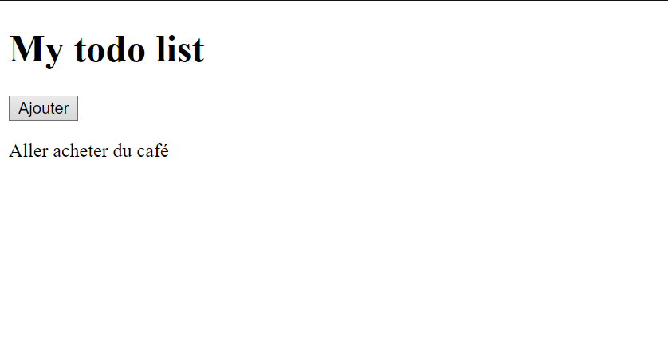

# Comme abordé dans l'introduction, nous allons réaliser une liste de tâches (todo list). Mais qu'est-ce qu'une todo list ?

Une todo list, c'est simplement une liste de tâches.

# Le besoin

Pour créer une todo list, nous avons besoin, pour le moment, des éléments suivants :

- Un titre pour nommer notre liste (par exemple, "Ma todo list").
- Un bouton qui, plus tard, nous servira à ajouter un élément à notre liste.
- Un texte qui représentera notre élément de liste (exemple : "Acheter du café").

## C'est parti !

Dans un premier temps, créez un fichier `index.html` dans le dossier actuel.

Tout fichier représentant un point d'entrée dans votre code se nommera généralement "index". Votre code fonctionnera quand même si vous le nommez autrement, mais c'est une convention.

Ensuite, utilisez Internet pour trouver les éléments dont vous avez besoin. Il est conseillé de rechercher en anglais pour avoir un maximum d'informations.

Au début, vous ne trouverez peut-être pas exactement ce que vous cherchez, mais c'est normal !

Au fur et à mesure, vous commencerez à développer votre langage technique et à réaliser des recherches plus pertinentes.

Un petit exemple :

Si vous recherchez "Title in HTML" sur Google, vous tomberez sur la balise `<title>`, qui permet de nommer votre page HTML dans l'onglet de votre navigateur.

Un titre, comme celui-ci :

# Je suis le titre

En HTML, sera nommé un "heading".

Essayez de rechercher "heading in HTML" sur Google, vous verrez !

Bref, à l'issue de cet exercice, votre page devrait à peu près ressembler à ceci : 

C'est basique, mais nous allons l'améliorer dans les prochains exercices.
